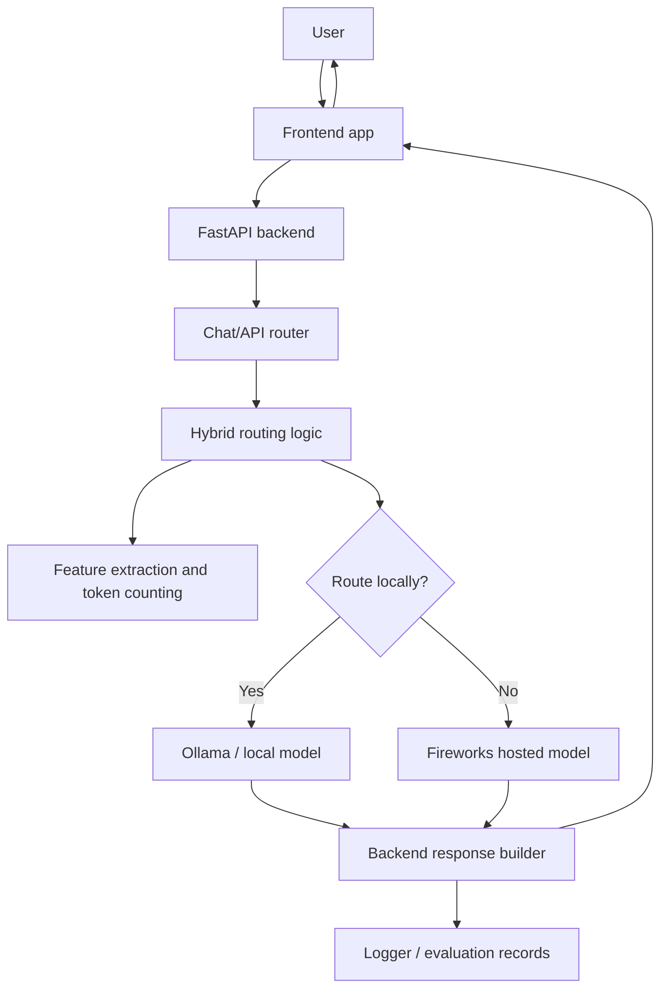
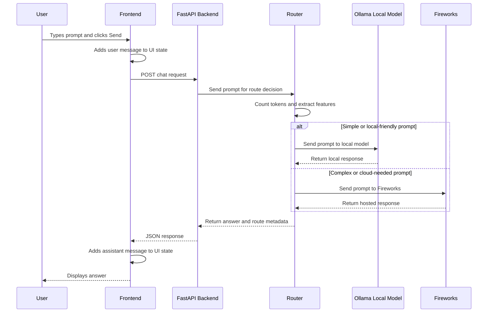
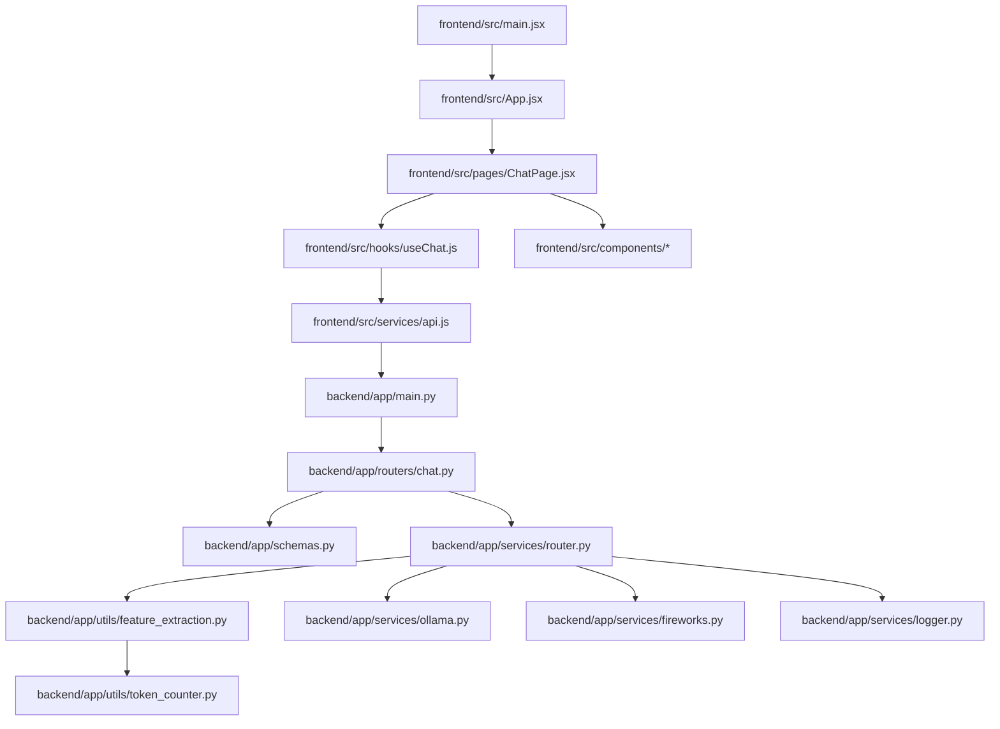

# Hybrid Token Router

Hybrid Token Router is a full-stack project for sending user prompts through a smart backend router that decides where the prompt should be answered: by a local model, usually through Ollama, or by a hosted model provider, such as Fireworks.

In simple language, the project is a chat application with routing intelligence. The frontend lets a user type a message. The backend receives that message, studies it, estimates useful information such as token count or complexity, chooses the best model path, sends the prompt to that model, and returns the final answer to the frontend.

The main idea is hybrid inference:

- Use a local model when the request is simple, cheaper, private, or fast enough locally.
- Use Fireworks when the request needs a stronger hosted model, better quality, or more capacity.
- Keep enough logs and evaluation data so the routing strategy can improve over time.

## Complete Architecture

The project is organized around three major layers:

1. Frontend

   The user interface. It collects prompts, displays responses, shows loading states, and calls the backend API.

2. Backend

   The application brain. It exposes HTTP endpoints, validates requests, runs routing logic, calls local or remote model services, logs activity, and returns responses.

3. Model Providers

   The execution layer. One path talks to a local model through Ollama. Another path talks to Fireworks for cloud inference.



## Request Flow From Frontend To Backend

1. The user types a prompt in the frontend.
2. The user clicks Send.
3. The frontend stores the user message in UI state.
4. The frontend sends an HTTP request to the backend chat endpoint.
5. The backend validates the request body.
6. The backend passes the prompt to the routing layer.
7. The router extracts features from the prompt.
8. The router decides whether to use the local model or Fireworks.
9. The selected model provider receives the prompt.
10. The model returns generated text.
11. The backend formats the response.
12. The backend logs useful metadata, such as route, latency, token estimate, and provider.
13. The frontend receives the answer.
14. The frontend updates the chat UI.

-----------------------------------------------------

## Folder Structure

Because this file was generated without running inspection commands, the folder explanations below describe the expected structure of this project based on its architecture. If a folder or file name differs in the repository, use the same explanation pattern for the matching file.

### backend/

The backend folder contains the FastAPI application. It is responsible for receiving chat requests, routing prompts, calling model providers, logging requests, and returning responses.

Expected responsibilities:

- API startup.
- Route registration.
- Chat endpoint handling.
- Request and response schemas.
- Routing strategy.
- Local model integration.
- Fireworks integration.
- Token counting.
- Feature extraction.
- Logging.
- Evaluation utilities.

### frontend/

The frontend folder contains the React application. It is responsible for the user interface, chat input, response display, API calls, loading states, and frontend-side data flow.

Expected responsibilities:

- Chat page.
- Message components.
- Input component.
- API service layer.
- State management through React hooks.
- Styling.
- Build configuration.

### docs/

The docs folder contains supporting documentation. It may include architecture notes, setup notes, API notes, or research material.

### backend/app/

This is commonly where the FastAPI application code lives. It usually contains `main.py`, routers, services, utilities, schemas, and configuration files.

### backend/app/routers/

This folder normally contains FastAPI route modules. A route module maps an HTTP path, such as `/chat`, to Python functions.

### backend/app/services/

This folder usually contains business logic that should not live directly inside API route functions. In this project, model calls, routing decisions, and logging services likely belong here.

### backend/app/utils/

This folder usually contains helper functions, such as token counting, feature extraction, formatting, or reusable validation helpers.

### backend/app/prompts/

This folder may contain prompt templates used before sending user input to a model.

### backend/app/evaluation/

This folder may contain scripts or modules used to test routing quality, compare local and hosted model answers, and measure latency or cost.

### frontend/src/

This is commonly the main React source folder. It contains components, pages, hooks, services, styles, and application entry files.

### frontend/src/components/

Reusable UI components live here. Chat bubbles, input boxes, provider badges, loading indicators, and layout pieces are examples.

### frontend/src/pages/

Page-level React components live here. A chat page or dashboard page would usually be placed here.

### frontend/src/hooks/

Reusable React state logic lives here. For example, a hook may manage chat messages, loading state, errors, and API calls.

### frontend/src/services/

Frontend API clients live here. These files call the backend using `fetch`, `axios`, or another HTTP client.

### frontend/src/styles/

CSS files, global styles, or styling modules live here.

### etc.

Other folders may include configuration, scripts, assets, tests, generated outputs, or environment examples.

-----------------------------------------------------

## File Explanation

This section explains the important expected files in the project. The exact filenames may vary, but the project roles should map closely to these descriptions.

### PROJECT_GUIDE.md

Purpose:

This file explains the entire project in simple language.

Why it exists:

It gives the developer a guided map of the codebase, architecture, request flow, and future roadmap.

Which files call it:

No source file calls this documentation file.

Which files it calls:

None.

Inputs:

The project structure and architecture.

Outputs:

A human-readable explanation of the project.

Future improvements:

Update this guide whenever new files, routes, model providers, evaluation scripts, or frontend pages are added.

### backend/app/main.py

Purpose:

Starts the FastAPI backend application.

Why it exists:

Every FastAPI project needs an application entry point. This file usually creates the `FastAPI()` app object, configures middleware, and includes routers.

Which files call it:

- The backend server command, such as `uvicorn app.main:app`.
- Deployment tools or local development scripts.

Which files it calls:

- Router files, such as `routers/chat.py`.
- Configuration files.
- Middleware setup.

Inputs:

- HTTP requests from the frontend.
- Environment configuration.

Outputs:

- A running FastAPI app.
- Registered API routes.

Future improvements:

- Add health check routes.
- Add better CORS configuration.
- Add centralized exception handling.
- Add structured startup and shutdown events.

How it fits into the project:

It is the backend doorway. All backend requests enter the FastAPI application created here.

### backend/app/routers/chat.py

Purpose:

Defines the chat API endpoint.

Why it exists:

The frontend needs one clear backend endpoint for sending user prompts and receiving model answers.

Which files call it:

- `backend/app/main.py` registers this router.
- The frontend API service calls the HTTP endpoint exposed here.

Which files it calls:

- Routing service.
- Request and response schemas.
- Logger or evaluation service.

Inputs:

- User prompt.
- Optional conversation history.
- Optional routing preferences.

Outputs:

- Model response text.
- Route metadata, such as local or Fireworks.
- Error messages if something fails.

Future improvements:

- Add streaming responses.
- Add conversation IDs.
- Add request validation for empty prompts.
- Add route explanation in the API response.

How it fits into the project:

It connects the frontend request to the backend routing system.

### backend/app/schemas.py

Purpose:

Defines request and response data shapes.

Why it exists:

FastAPI works best when request bodies and responses are described with structured models, usually Pydantic models.

Which files call it:

- API routers.
- Services that need typed request or response data.

Which files it calls:

- Usually none, except Python typing and Pydantic.

Inputs:

- Raw JSON from frontend requests.

Outputs:

- Validated Python objects.
- JSON-compatible response objects.

Future improvements:

- Add stricter validation.
- Add fields for token count, cost estimate, latency, route reason, and model name.

How it fits into the project:

It keeps the API contract clear between frontend and backend.

### backend/app/services/router.py

Purpose:

Chooses whether a prompt should go to the local model or Fireworks.

Why it exists:

The project is not just a chat app. Its core feature is deciding the best model route for each prompt.

Which files call it:

- `backend/app/routers/chat.py`.
- Evaluation scripts.

Which files it calls:

- Token counting utility.
- Feature extraction utility.
- Local model service.
- Fireworks service.
- Logger.

Inputs:

- User prompt.
- Conversation context.
- Token estimate.
- Prompt complexity features.
- Optional configuration thresholds.

Outputs:

- Selected provider.
- Model response.
- Routing metadata.

Future improvements:

- Replace rule-based routing with learned routing.
- Add cost-aware routing.
- Add latency-aware routing.
- Add user-selectable routing modes.
- Add confidence scoring.

How it fits into the project:

This is the heart of the Hybrid Token Router.

### backend/app/services/ollama.py

Purpose:

Calls the local model through Ollama.

Why it exists:

Ollama makes it possible to run local language models. This gives the project a private and potentially cheaper inference path.

Which files call it:

- Routing service.
- Evaluation tools.

Which files it calls:

- Ollama HTTP API or local client.
- Logger on success or failure.

Inputs:

- Prompt.
- Model name.
- Optional generation parameters.

Outputs:

- Generated text from the local model.
- Error information if Ollama is unavailable.

Future improvements:

- Add retries.
- Add timeout handling.
- Add model availability checks.
- Add streaming support.

How it fits into the project:

It is the local inference adapter.

### backend/app/services/fireworks.py

Purpose:

Calls Fireworks for hosted model inference.

Why it exists:

Some prompts may require a stronger or faster hosted model. Fireworks provides the cloud model path.

Which files call it:

- Routing service.
- Evaluation tools.

Which files it calls:

- Fireworks API.
- Environment variable configuration for API keys.
- Logger.

Inputs:

- Prompt.
- Model name.
- API key.
- Generation parameters.

Outputs:

- Generated text from Fireworks.
- Provider metadata.
- Error information if the request fails.

Future improvements:

- Add fallback if Fireworks fails.
- Add cost tracking.
- Add model selection based on prompt type.
- Add response streaming.

How it fits into the project:

It is the hosted inference adapter.

### backend/app/utils/token_counter.py

Purpose:

Estimates or counts how many tokens a prompt contains.

Why it exists:

Token count is one of the simplest and most useful signals for routing. Longer prompts may need different models, different cost handling, or different context windows.

Which files call it:

- Routing service.
- Evaluation scripts.
- Logging service.

Which files it calls:

- Tokenizer library, if configured.
- Python helper functions.

Inputs:

- Prompt text.
- Optional model name.

Outputs:

- Token count estimate.

Future improvements:

- Use model-specific tokenizers.
- Count prompt and response tokens separately.
- Track total cost based on token usage.

How it fits into the project:

It provides a measurable routing feature.

### backend/app/utils/feature_extraction.py

Purpose:

Extracts useful characteristics from the prompt.

Why it exists:

A router needs signals. Feature extraction can identify length, complexity, code content, question type, language, or other patterns.

Which files call it:

- Routing service.
- Evaluation scripts.

Which files it calls:

- Token counter.
- Text processing helpers.

Inputs:

- User prompt.
- Optional conversation history.

Outputs:

- Feature dictionary, such as token count, prompt length, complexity flag, or task type.

Future improvements:

- Add code detection.
- Add intent classification.
- Add complexity scoring.
- Add safety or privacy classification.

How it fits into the project:

It gives the router more information than raw text alone.

### backend/app/services/logger.py

Purpose:

Records important backend events.

Why it exists:

Routing systems need observability. Logs help understand what route was chosen, how long it took, and whether the response succeeded.

Which files call it:

- Chat router.
- Routing service.
- Ollama service.
- Fireworks service.
- Evaluation tools.

Which files it calls:

- Python logging.
- File system or database, depending on implementation.

Inputs:

- Prompt metadata.
- Selected route.
- Latency.
- Provider.
- Error messages.

Outputs:

- Log records.
- Evaluation records.

Future improvements:

- Add structured JSON logs.
- Add request IDs.
- Add persistent database storage.
- Add dashboards.

How it fits into the project:

It makes the router inspectable and easier to improve.

### backend/app/evaluation/evaluate.py

Purpose:

Tests how well the routing strategy performs.

Why it exists:

A router should be measured. Evaluation helps compare local and hosted answers, latency, quality, and cost.

Which files call it:

- Developer-run evaluation commands.

Which files it calls:

- Routing service.
- Local model service.
- Fireworks service.
- Logger.

Inputs:

- Test prompts.
- Expected behavior or scoring rules.

Outputs:

- Evaluation results.
- Accuracy, latency, or route statistics.

Future improvements:

- Add labeled datasets.
- Add automated quality scoring.
- Add regression tests for routing.
- Add charts and reports.

How it fits into the project:

It turns routing from guesswork into measurable behavior.

### backend/app/config.py

Purpose:

Stores backend configuration.

Why it exists:

API keys, model names, route thresholds, CORS origins, and provider URLs should be centralized.

Which files call it:

- Main app.
- Fireworks service.
- Ollama service.
- Routing service.

Which files it calls:

- Environment variable loader.

Inputs:

- `.env` values.
- System environment variables.

Outputs:

- Configuration values for the rest of the backend.

Future improvements:

- Add validation for missing required variables.
- Add environment-specific settings.
- Add typed settings with Pydantic.

How it fits into the project:

It prevents configuration from being scattered across the backend.

### backend/requirements.txt

Purpose:

Lists Python dependencies.

Why it exists:

It lets a developer install the backend dependencies consistently.

Which files call it:

- Package installation commands.
- Deployment setup.

Which files it calls:

None.

Inputs:

- Dependency names and versions.

Outputs:

- Installed Python packages.

Future improvements:

- Pin exact versions.
- Move to `pyproject.toml` if the project grows.
- Separate development and production dependencies.

How it fits into the project:

It defines the backend runtime environment.

### frontend/src/main.jsx or frontend/src/main.tsx

Purpose:

Starts the React application in the browser.

Why it exists:

React needs an entry point that renders the root component into the HTML page.

Which files call it:

- Frontend build tool, such as Vite.

Which files it calls:

- `App.jsx` or `App.tsx`.
- Global styles.

Inputs:

- Browser DOM element.

Outputs:

- Mounted React application.

Future improvements:

- Add route providers.
- Add query client providers.
- Add error boundaries.

How it fits into the project:

It is the frontend startup file.

### frontend/src/App.jsx or frontend/src/App.tsx

Purpose:

Defines the main frontend component.

Why it exists:

The app needs a top-level component that organizes the page layout and renders the chat experience.

Which files call it:

- Frontend entry file.

Which files it calls:

- Chat page.
- Layout components.
- Global providers.

Inputs:

- Application state or route state.

Outputs:

- Main UI tree.

Future improvements:

- Add frontend routing.
- Add settings page.
- Add provider status panel.

How it fits into the project:

It is the root of the frontend component hierarchy.

### frontend/src/pages/ChatPage.jsx

Purpose:

Displays the main chat screen.

Why it exists:

The central user workflow is asking a prompt and reading the response.

Which files call it:

- `App.jsx`.

Which files it calls:

- Chat input component.
- Message list component.
- API service or chat hook.

Inputs:

- User prompt.
- Chat state.
- Loading state.
- Error state.

Outputs:

- Rendered chat interface.
- Calls to backend when the user sends a prompt.

Future improvements:

- Add conversation history.
- Add route badges.
- Add streaming output.
- Add retry button.

How it fits into the project:

It is the main frontend user experience.

### frontend/src/components/ChatInput.jsx

Purpose:

Lets the user type and submit a prompt.

Why it exists:

The chat app needs a reusable input box and send button.

Which files call it:

- Chat page.

Which files it calls:

- Callback function passed from the parent.

Inputs:

- Current text.
- Submit callback.
- Disabled or loading state.

Outputs:

- Prompt text submitted to the parent component.

Future improvements:

- Add keyboard shortcuts.
- Add file upload.
- Add input token preview.
- Add prompt templates.

How it fits into the project:

It is the frontend starting point for each request.

### frontend/src/components/MessageList.jsx

Purpose:

Displays the conversation messages.

Why it exists:

Users need to see both their prompts and model responses.

Which files call it:

- Chat page.

Which files it calls:

- Message bubble component.

Inputs:

- Array of chat messages.

Outputs:

- Rendered list of user and assistant messages.

Future improvements:

- Add auto-scroll.
- Add markdown rendering.
- Add copy buttons.
- Add route metadata display.

How it fits into the project:

It visualizes the conversation state.

### frontend/src/components/MessageBubble.jsx

Purpose:

Displays one message.

Why it exists:

User messages and assistant responses should have consistent styling.

Which files call it:

- Message list.

Which files it calls:

- Optional markdown renderer.

Inputs:

- Message role.
- Message content.
- Optional metadata.

Outputs:

- One rendered chat bubble.

Future improvements:

- Add syntax highlighting.
- Add provider badge.
- Add latency display.

How it fits into the project:

It is the smallest visual unit of the chat.

### frontend/src/hooks/useChat.js

Purpose:

Manages chat state and send-message behavior.

Why it exists:

React components stay cleaner when stateful logic is moved into a hook.

Which files call it:

- Chat page.

Which files it calls:

- Frontend API service.

Inputs:

- User prompt.

Outputs:

- Messages.
- Loading state.
- Error state.
- Send function.

Future improvements:

- Add cancellation.
- Add streaming support.
- Add local persistence.
- Add conversation reset.

How it fits into the project:

It controls the frontend chat lifecycle.

### frontend/src/services/api.js

Purpose:

Calls the backend API.

Why it exists:

Frontend components should not hard-code HTTP request details everywhere.

Which files call it:

- `useChat.js`.
- Any page or component that needs backend data.

Which files it calls:

- Browser `fetch` or HTTP client.

Inputs:

- Prompt.
- Conversation history.

Outputs:

- Parsed backend response.
- Errors if the backend request fails.

Future improvements:

- Add base URL configuration.
- Add typed API responses.
- Add retry behavior.
- Add better error messages.

How it fits into the project:

It is the bridge from React to FastAPI.

### frontend/package.json

Purpose:

Defines frontend scripts and JavaScript dependencies.

Why it exists:

The frontend build tool uses this file to know how to run, build, and test the React app.

Which files call it:

- Package manager commands.
- Build tools.

Which files it calls:

None directly.

Inputs:

- Script definitions.
- Dependency list.

Outputs:

- Installed frontend packages.
- Runnable frontend scripts.

Future improvements:

- Add lint script.
- Add test script.
- Pin dependency versions.

How it fits into the project:

It defines the frontend runtime and development workflow.

### README.md

Purpose:

Introduces the project.

Why it exists:

A README gives quick setup and overview information.

Which files call it:

None.

Which files it calls:

None.

Inputs:

- Human-written project description.

Outputs:

- Human-readable project overview.

Future improvements:

- Add screenshots.
- Add setup steps.
- Add environment variable examples.
- Add API examples.

How it fits into the project:

It is the first document most people read.

### .env or .env.example

Purpose:

Stores or documents environment variables.

Why it exists:

API keys and local configuration should not be hard-coded in source files.

Which files call it:

- Backend configuration.
- Frontend configuration if a frontend environment file exists.

Which files it calls:

None.

Inputs:

- API keys.
- Model names.
- Backend URLs.
- Provider URLs.

Outputs:

- Configuration values loaded by the app.

Future improvements:

- Keep real `.env` files out of version control.
- Maintain a safe `.env.example`.
- Document every variable.

How it fits into the project:

It allows the same code to run in different environments.

-----------------------------------------------------

## API Flow

The prompt travels through the system like this:

```text
User
↓
Frontend
↓
Backend
↓
Router
↓
Local Model or Fireworks
↓
Response
```

More detailed version:



-----------------------------------------------------

## Frontend Walkthrough

The frontend is the user's control panel for the project.

### Every Component

Expected component roles:

- `App`: Root component. Sets up the main layout.
- `ChatPage`: Main page for sending prompts and reading responses.
- `ChatInput`: Text input and send button.
- `MessageList`: Displays all messages.
- `MessageBubble`: Displays one message.
- `LoadingIndicator`: Shows that the backend is processing.
- `ErrorMessage`: Shows failed request messages.
- `ProviderBadge`: Optional component showing whether the response came from local model or Fireworks.

### Every Page

The main expected page is the chat page.

The chat page:

- Stores messages.
- Accepts user input.
- Calls the backend.
- Renders model output.
- Shows loading and error states.

Possible future pages:

- Evaluation dashboard.
- Logs dashboard.
- Settings page for route thresholds and model choices.
- Prompt history page.

### Every Hook

The most important expected hook is `useChat`.

`useChat` should:

- Store message history.
- Store loading state.
- Store errors.
- Expose a `sendMessage` function.
- Call the frontend API service.
- Add assistant responses to state.

### Every Service

The frontend service layer usually contains API functions.

The main service should:

- Know the backend base URL.
- Send prompts to the backend.
- Parse the backend response.
- Throw useful errors when requests fail.

### How Data Flows

```text
ChatInput
↓ typed prompt
ChatPage / useChat
↓ API call
frontend service
↓ HTTP request
backend
↓ JSON response
frontend service
↓ parsed data
useChat
↓ state update
MessageList
↓
MessageBubble
```

### Component Hierarchy

```text
App
└── ChatPage
    ├── MessageList
    │   └── MessageBubble
    ├── ChatInput
    ├── LoadingIndicator
    └── ErrorMessage
```

-----------------------------------------------------

## Backend Walkthrough

The backend is the decision-making part of the project.

### Routers

Routers define API endpoints.

The chat router is responsible for:

- Receiving prompts.
- Validating request data.
- Calling the routing service.
- Returning model responses.

### Services

Services contain the main backend behavior.

Important services:

- Router service: chooses local model or Fireworks.
- Ollama service: sends prompts to local models.
- Fireworks service: sends prompts to hosted models.
- Logger service: records request and routing metadata.

### Utilities

Utilities support services with reusable helper logic.

Important utilities:

- Token counting.
- Feature extraction.
- Formatting.
- Error handling.

### Prompts

Prompt files or prompt helpers define reusable instructions for models.

They may be used to:

- Standardize model behavior.
- Wrap user prompts with system instructions.
- Add evaluation prompts.

### Database

If the project currently has no database, logs may be stored in files or printed to the console.

A future database could store:

- Conversations.
- Routing decisions.
- Latency.
- Token usage.
- Evaluation results.
- User feedback.

### Logger

The logger should capture:

- Request timestamp.
- Prompt length.
- Token estimate.
- Selected route.
- Provider.
- Model name.
- Latency.
- Errors.

### Evaluation

Evaluation helps answer:

- Did the router choose the right provider?
- Was the local model good enough?
- Was Fireworks worth the extra cost?
- How long did each provider take?
- Which prompt types fail?

### Feature Extraction

Feature extraction converts a prompt into routing signals.

Examples:

- Character length.
- Token count.
- Whether the prompt contains code.
- Whether the prompt asks for reasoning.
- Whether the prompt is short or long.
- Whether the prompt is likely simple or complex.

-----------------------------------------------------

## Routing Logic

### Current Routing Strategy

The current routing strategy is best understood as rule-based hybrid routing.

Typical rules may include:

- Short prompts go to the local model.
- Long prompts go to Fireworks.
- Simple prompts go to the local model.
- Complex prompts go to Fireworks.
- Prompts requiring stronger reasoning go to Fireworks.
- If local model fails, fallback to Fireworks.

### Why It Was Chosen

Rule-based routing is a good first version because:

- It is easy to understand.
- It is easy to debug.
- It does not require training data.
- It lets the developer quickly test the hybrid architecture.

### Advantages

- Simple implementation.
- Predictable behavior.
- Easy to change thresholds.
- Good starting point for evaluation.
- Helps reduce cloud usage for simple prompts.

### Disadvantages

- Rules can be too simple.
- Hard to detect true prompt difficulty.
- May route some complex prompts locally by mistake.
- May route some simple prompts to Fireworks unnecessarily.
- Does not automatically learn from past performance.

### Possible Future Improvements

- Add model confidence scoring.
- Add user feedback buttons.
- Add learned routing model.
- Add cost-aware routing.
- Add latency-aware routing.
- Add fallback chains.
- Add route explanations.
- Add per-user preferences.

-----------------------------------------------------

## How I Should Continue Building This Project

### 1. Make The Current API Contract Clear

Define exactly what the frontend sends and what the backend returns.

Why first:

Everything depends on a stable contract. The frontend, router, logger, and evaluation tools all need the same response shape.

### 2. Add Strong Request And Response Schemas

Use clear backend schemas for chat requests and responses.

Why next:

Typed schemas prevent confusion and make the API easier to test.

### 3. Improve Routing Metadata

Return fields such as:

- Selected provider.
- Model name.
- Token estimate.
- Route reason.
- Latency.

Why next:

You need visibility before you can improve routing.

### 4. Add Better Logging

Store structured logs for each request.

Why next:

Logs create the dataset needed for debugging and evaluation.

### 5. Add Evaluation Prompts

Create a small test set of prompts:

- Simple questions.
- Coding questions.
- Long prompts.
- Reasoning prompts.
- Summarization prompts.

Why next:

You need repeatable tests to know whether routing changes help.

### 6. Add Fallback Behavior

If Ollama fails, use Fireworks. If Fireworks fails, return a clear error.

Why next:

Fallbacks make the app more reliable.

### 7. Add Streaming Responses

Stream tokens from backend to frontend.

Why next:

Streaming improves the user experience, especially for long responses.

### 8. Add A Routing Dashboard

Show route decisions, latency, and provider usage.

Why next:

The project becomes easier to explain, demo, and improve.

### 9. Add Learned Routing

Train or build a classifier that predicts the best provider.

Why later:

Learned routing needs data. Logs and evaluations should come first.

### 10. Add Cost Tracking

Estimate the cost of Fireworks calls and compare it against local usage.

Why later:

Cost tracking is most useful after the app is stable and logging works.

-----------------------------------------------------

## Learning Notes

### React

React is used to build the frontend interface.

Inside this project, React likely handles:

- Chat input.
- Message display.
- Loading state.
- Error state.
- API response rendering.

Important concept:

React state changes cause the UI to update. When the backend returns a response, the frontend adds a new assistant message to state, and React redraws the chat.

### FastAPI

FastAPI is used to build the backend API.

Inside this project, FastAPI likely handles:

- HTTP routes.
- JSON request parsing.
- Response formatting.
- API documentation.
- CORS for frontend access.

Important concept:

FastAPI route functions are the bridge between HTTP requests and Python service logic.

### Ollama

Ollama is used to run local language models.

Inside this project, Ollama likely handles:

- Local inference.
- Private prompt processing.
- Lower-cost responses for simple prompts.

Important concept:

Ollama gives the router a local path, so every request does not have to go to a cloud provider.

### Fireworks

Fireworks is used as a hosted model provider.

Inside this project, Fireworks likely handles:

- More complex prompts.
- Higher-quality model responses.
- Cloud inference.

Important concept:

Fireworks gives the router a stronger remote path when local inference may not be enough.

### Routing

Routing means choosing which model provider should answer a prompt.

Inside this project, routing likely uses:

- Token count.
- Prompt length.
- Prompt complexity.
- Provider availability.
- Rules or thresholds.

Important concept:

The router is what makes the project more than a normal chat app.

### Token Counting

Token counting estimates how much text the model must process.

Inside this project, token counting is useful for:

- Deciding local vs hosted route.
- Estimating cost.
- Avoiding context length problems.
- Logging usage.

Important concept:

Tokens are not exactly words. A token can be a word, part of a word, punctuation, or whitespace depending on the tokenizer.

### Evaluation

Evaluation measures whether the routing strategy works well.

Inside this project, evaluation can compare:

- Local response quality.
- Fireworks response quality.
- Latency.
- Cost.
- Route accuracy.

Important concept:

Without evaluation, routing decisions are just guesses.

-----------------------------------------------------

## File Dependency Diagram

Expected backend dependency flow:

```text
main.py
↓
routers/chat.py
↓
services/router.py
↓
utils/feature_extraction.py
↓
utils/token_counter.py
```

Model provider flow:

```text
services/router.py
├── services/ollama.py
└── services/fireworks.py
```

Logging flow:

```text
routers/chat.py
↓
services/router.py
↓
services/logger.py
```

Frontend dependency flow:

```text
main.jsx
↓
App.jsx
↓
pages/ChatPage.jsx
↓
hooks/useChat.js
↓
services/api.js
↓
FastAPI backend
```

Complete expected dependency graph:



-----------------------------------------------------

## Backend Request Lifecycle

This is exactly what happens when the user clicks Send, from the backend point of view:

1. The backend receives a POST request from the frontend.
2. FastAPI matches the URL to the chat route.
3. FastAPI validates the request body.
4. The chat route extracts the prompt.
5. The chat route calls the routing service.
6. The routing service counts tokens.
7. The routing service extracts features.
8. The routing service compares features against routing rules.
9. The routing service chooses local model or Fireworks.
10. If local is chosen, the Ollama service sends the prompt to the local model.
11. If Fireworks is chosen, the Fireworks service sends the prompt to the hosted model.
12. The selected provider returns generated text.
13. The routing service packages the answer with metadata.
14. The logger records route, latency, provider, and errors if any.
15. The chat route returns a JSON response.
16. FastAPI sends the response back to the frontend.

-----------------------------------------------------

## Frontend Lifecycle

This is exactly how the UI updates:

1. The user types in the chat input.
2. React stores the input value in component state.
3. The user clicks Send.
4. The frontend creates a user message object.
5. The user message is added to the messages array.
6. The input box is cleared.
7. Loading state becomes true.
8. The frontend API service sends the prompt to the backend.
9. React renders the loading state.
10. The backend response arrives.
11. The frontend creates an assistant message object.
12. The assistant message is added to the messages array.
13. Loading state becomes false.
14. React re-renders the message list.
15. The user sees the answer.

If an error happens:

1. The API request fails.
2. The error state is updated.
3. Loading state becomes false.
4. The UI shows an error message.
5. The user can try again.

-----------------------------------------------------

## Improvements

### Easy

- Add route metadata to the frontend.
- Show whether a response came from Ollama or Fireworks.
- Add better error messages.
- Add loading indicators.
- Add request validation for empty prompts.
- Add a health check endpoint.
- Add `.env.example`.
- Document setup steps in `README.md`.

### Medium

- Add structured JSON logging.
- Add conversation history.
- Add streaming responses.
- Add fallback routing.
- Add markdown rendering for responses.
- Add syntax highlighting for code responses.
- Add evaluation prompt sets.
- Add latency tracking.
- Add token usage tracking.

### Advanced

- Add learned routing.
- Add cost-aware optimization.
- Add quality scoring.
- Add user feedback loops.
- Add a dashboard for routing analytics.
- Add persistent database storage.
- Add authentication.
- Add multi-provider routing.
- Add A/B testing for routing strategies.

-----------------------------------------------------

## Interview Questions

### What problem does Hybrid Token Router solve?

It solves the problem of choosing the right model provider for each prompt. Instead of sending every request to a hosted model, it can use a local model for simpler prompts and Fireworks for harder prompts.

### Why use both Ollama and Fireworks?

Ollama provides local inference, which can be cheaper and more private. Fireworks provides hosted inference, which can be more powerful and reliable for complex prompts.

### What is the role of FastAPI in this project?

FastAPI exposes backend endpoints. It receives frontend requests, validates data, calls the router, and returns JSON responses.

### What is the role of React in this project?

React provides the user interface. It handles chat input, message display, loading state, errors, and API calls.

### What is routing in this project?

Routing is the decision process that chooses whether a prompt should go to the local model or Fireworks.

### What features can be used for routing?

Useful features include token count, prompt length, complexity, whether the prompt includes code, and whether the task needs strong reasoning.

### Why is token counting important?

Token counting helps estimate prompt size, cost, and whether a model can handle the request within its context window.

### What are the advantages of local inference?

Local inference can be cheaper, more private, and independent of cloud provider availability.

### What are the disadvantages of local inference?

Local models may be slower, weaker, or limited by the developer's machine.

### What are the advantages of Fireworks?

Fireworks can provide stronger hosted models, better scalability, and more reliable performance for difficult prompts.

### What are the disadvantages of Fireworks?

It may cost money, require an API key, and send prompts to an external provider.

### How would you improve the router?

I would first add structured logging and evaluation, then use that data to improve rules, add fallbacks, and eventually build a learned routing model.

### How would you measure success?

I would measure response quality, latency, cost, route accuracy, provider failure rate, and user satisfaction.

### What would you do if Ollama fails?

The backend should catch the error and fallback to Fireworks if possible. If both fail, it should return a clear error to the frontend.

### What would you do if Fireworks fails?

The backend could fallback to Ollama for simple prompts or return a clear error for prompts that require Fireworks.

### Why should the project log route decisions?

Logs help debug the system and create data for improving routing decisions.

-----------------------------------------------------

## Resume Explanation

You can describe this project to recruiters like this:

Hybrid Token Router is a full-stack AI routing application that intelligently sends user prompts either to a local Ollama model or to a hosted Fireworks model. I built a React frontend for the chat interface and a FastAPI backend that validates requests, extracts prompt features, estimates token usage, applies routing logic, calls the selected model provider, and returns the response with routing metadata.

Short resume bullet:

- Built a full-stack hybrid AI routing system using React, FastAPI, Ollama, and Fireworks to dynamically route prompts between local and hosted LLM inference based on token and complexity signals.

Stronger resume bullets:

- Designed a FastAPI routing backend that evaluates prompt features and selects between local Ollama inference and Fireworks-hosted models.
- Built a React chat interface that sends prompts to the backend and displays model responses with a clean request lifecycle.
- Implemented the foundation for cost-aware and latency-aware LLM routing through token counting, feature extraction, logging, and evaluation workflows.

Recruiter-friendly explanation:

This project shows that I understand how modern AI applications are built beyond just calling one API. It demonstrates frontend development, backend API design, local model integration, hosted model integration, routing logic, and the engineering tradeoffs between cost, latency, privacy, and quality.

Technical explanation:

The system uses a React frontend and FastAPI backend. When a user submits a prompt, the backend extracts features such as token count and complexity, then applies routing rules to choose either Ollama for local inference or Fireworks for cloud inference. The response is returned to the frontend, and metadata can be logged for evaluation and future routing improvements.

-----------------------------------------------------

## Final Mental Model

Think of the project as a traffic controller for AI prompts.

The frontend asks the question.

The backend receives it.

The router studies it.

The router chooses the best road.

One road goes to Ollama.

One road goes to Fireworks.

The selected model answers.

The backend returns the answer.

The frontend shows it to the user.

That routing decision is the main value of the project.
