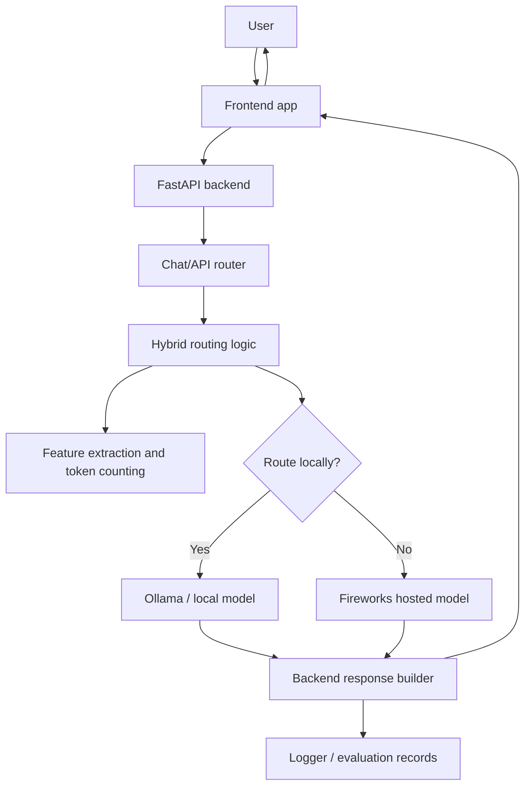

The project is a chat application with routing intelligence. The frontend lets a user type a message. The backend receives that message, studies it, estimates useful information such as token count or complexity, chooses the best model path, sends the prompt to that model, and returns the final answer to the frontend.

The main idea is hybrid inference:

- Use a local model when the request is simple, cheaper, private, or fast enough locally.
- Use Fireworks when the request needs a stronger hosted model, better quality, or more capacity.
- Keep enough logs and evaluation data so the routing strategy can improve over time.

## Complete Architecture

The project is organized around three major layers:

1. Frontend

   The user interface. It collects prompts, displays responses, shows loading states, and calls the backend API.

2. Backend

   The application brain. It exposes HTTP endpoints, validates requests, runs routing logic, calls local or remote model services, logs activity, and returns responses.

3. Model Providers

   The execution layer. One path talks to a local model through Ollama. Another path talks to Fireworks for cloud inference.

