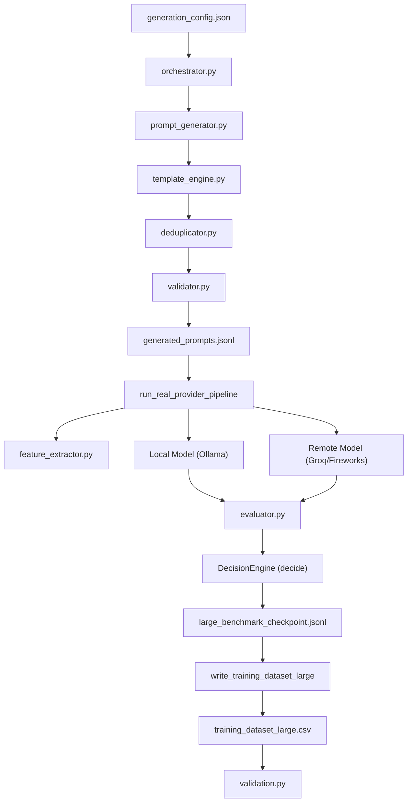

# Research-Grade Data Generation Pipeline: Large Dataset Guide

This document covers the technical architecture, design parameters, and operational instructions for executing the large dataset generation pipeline (1000 to 50000+ examples) on AMD Cloud.

---

## 1. System Architecture

The pipeline consists of decoupled components communicating through structured files and services:



---

## 2. Prompt Generation Methodology & Diversity

Every prompt is composed from several independent orthogonal dimensions, yielding high-entropy, realistic developer workloads:
- **Category (8)**: Coding, Planning, Reasoning, Translation, Summarization, Creative Writing, General, Mathematics.
- **Domain (15)**: Healthcare, Finance, Cybersecurity, Cloud, Databases, Distributed Systems, Retail, Robotics, Legal, Research, Business, Government, Science, Education, and others.
- **Difficulty (3)**: Easy, Medium, Hard.
- **Output Format (10)**: Markdown tables, JSON blocks, checklists, executive briefs, bullet lists, numbered steps, etc.
- **Reasoning Depth (3)**: Low, Medium, High.
- **Constraints (21)**: Word limits, citation placeholders, auditability flags, complexity bounds, rollback steps, etc.

By systematically varying the indices using prime-modulo combinations, the template engine ensures that we can scale up to **50,000+** prompts with near-zero combinatorial repetition.

---

## 3. Metadata Schema

Every generated prompt record contains the following metadata:
```json
{
  "id": "gen_000001",
  "prompt_id": "gen_000001",
  "prompt": "Write production-ready code for a risk analyst that processes a credit model involving merchant account...",
  "category": "coding",
  "difficulty": "medium",
  "expected_reasoning": "medium",
  "domain": "finance",
  "constraint_count": 2,
  "estimated_complexity": 0.69,
  "estimated_input_tokens": 42,
  "output_type": "JSON object",
  "generation_template": "coding_0",
  "timestamp": "2026-07-08T01:45:00Z"
}
```

---

## 4. Quality Control

The pipeline performs automatic quality control before running model execution:
1. **Deduplication**: 
   - Exact duplicates: Screened using SHA-1 hashes of normalized prompt text.
   - Near-duplicates: Computes 5-word shingle Jaccard similarity. Matches with similarity $\ge 0.82$ are rejected.
2. **Short/Incomplete Prompts**: Validates prompts are $\ge 8$ words and end with standard punctuation.
3. **Distribution Checks**: Ensures category, difficulty, and domain distribution deviations do not exceed imbalanced ratios (max/min $\le 1.35$).
4. **Markdown Reports**: Automatically compiles `dataset_quality_report.md`, `generation_statistics.md`, and `coverage_report.md` in the docs folder.

---

## 5. Checkpointing & Resumability

To handle network outages or API rate limit exhaustions:
- Benchmarking writes progress incrementally to `large_benchmark_checkpoint.jsonl` using file-append mode (`"a"`).
- On initialization, the orchestrator scans the checkpoint file for existing prompt IDs and filters them out of the pending work queue.
- If execution stops, re-running the command resumes processing the next prompt automatically, preventing redundant calls.

---

## 6. AMD Cloud Execution Workflow

Running massive workloads requires resource optimization. Follow this recipe to run on AMD Cloud:

### Step A: Prerequisites & Setup
1. Spin up your AMD cloud GPU instance.
2. Ensure Ollama is running local model:
   ```bash
   ollama run qwen2.5:3b
   ```
3. Set your Groq/Fireworks credentials in `backend/.env`.

### Step B: Run Large Generation Pipeline
Configure your pipeline parameters in `backend/generation_config.json` or override via command line:
```bash
# Example: Generate and benchmark 5000 prompts
$env:PYTHONPATH="."
python backend/app/data_generation/orchestrator.py --size 5000 --batch-size 50 --concurrency-limit 10
```

- **Memory Efficiency**: RAM usage is minimal as records are read/written incrementally.
- **Concurrency Tune**: Adjust `--concurrency-limit` based on your API tier rate limit. (Groq API rate limits typically support 10-20 concurrent requests safely).

### Step C: Post-Generation Validation
Ensure the dataset matches feature column constraints:
```bash
python backend/app/ml/validation.py --csv_path backend/app/data/training/training_dataset_large.csv
```
---
